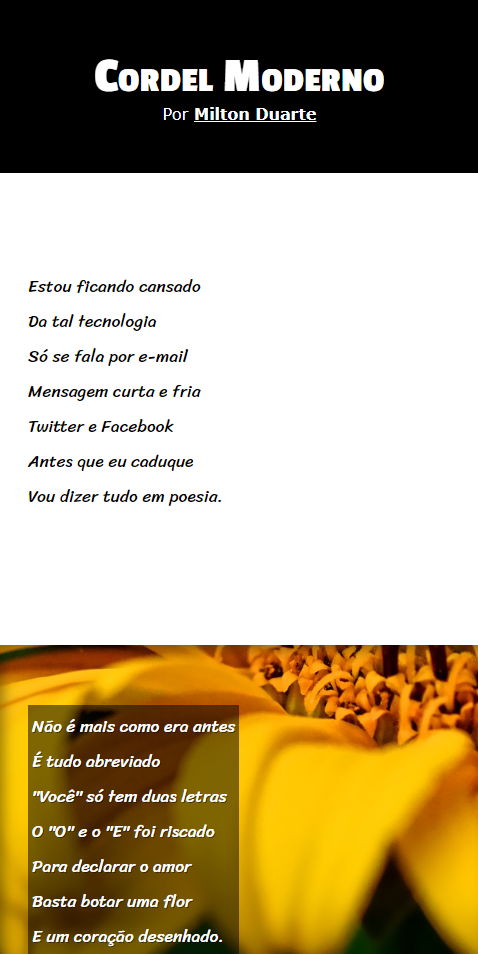

# Projeto Cordel

Exercício do Módulo 03 do [curso de HTML e CSS do Curso em Vídeo](https://youtu.be/cz7AoKGcwlY).

 

## Live Demo
[Acesse o projeto aqui!](https://victoriaduarte.github.io/projeto-cordel/)

 

## O que aprendi
- Variáveis CSS
- Background images
- Efeito parallax
- Unidade de medida relativa (vh)
- Importação de Google Fonts

 

## Preview

